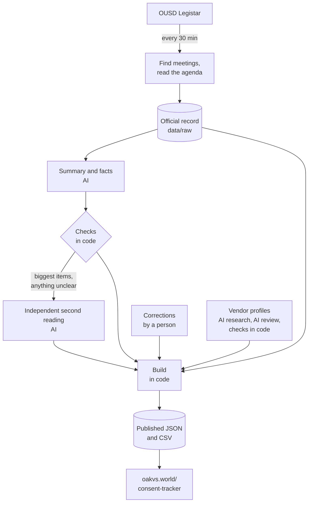

# OUSD Consent Tracker: open data

Every item the Oakland Unified School District (OUSD) Board of Education has approved through its **General Consent Report** since August 2025: the official text from Legistar, a plain-English summary, the dollar amounts checked in code, flags, outcomes and votes, and profiles of the vendors involved. The data updates on its own every 30 minutes, and anyone can reuse it.

The reader-friendly version is the **[Consent Tracker on Oakland vs. the World](https://oakvs.world/consent-tracker)**. This repository is everything behind it: the data, the code that produces it, and the full history of every change.

This is an independent project. It is not an official OUSD project and is not affiliated with the district.

All engineering, compute and hosting costs are donated by [Aleph](https://aleph.dev).

| As of October 2, 2026 | |
|---|---|
| Board meetings covered | 26 (August 13, 2025 – September 23, 2026) |
| Consent items | 2,149 (6 to 263 per meeting) |
| Spending authorized on consent | $468.7 million, across 1,248 items |
| Money coming in (grants, reimbursements) | $112.2 million |
| Vendors and partners | 757, of which 506 have a verified profile |

## Why this exists

At most of its public meetings, the OUSD Board approves tens of millions of dollars in a single vote: the General Consent Report, which bundles dozens to hundreds of contracts, grants, amendments and agreements. Board members and the public get a few days' notice to read it, as a long PDF or through Legistar, the district's agenda system. The information is all public, but it's hard to read, hard to search, and impossible to follow over time.

The tracker was built by an OUSD parent who has been a web developer for over two decades, to make the consent report readable and trackable. It puts every item in plain English, adds up the money consistently, and keeps a permanent record of what was approved, revised and decided. The aim is a set of shared facts about how the district spends money that the Board, district staff, reporters and families can all work from. The tracker reorganizes OUSD's own public records; it doesn't replace them, and it describes procedures, not motives.

## What's in the data

Each consent item carries three kinds of information, and the data keeps them apart so you always know which is which.

| | Fields | Where it comes from |
|---|---|---|
| **Official record** | title, official action text, file number, agenda number, matter type, presenting office, vendor number, funding source, attachments, action history, outcome, roll-call votes | OUSD's Legistar system, copied as published. The action text is the source of truth for everything else. |
| **Computed in code** | meeting totals, most flags, review status, vendor grouping, links between amendments of the same contract | Plain code with no AI involved, from the official record and the facts below. Fully reproducible. |
| **AI-written, then checked** | headline, summary, category, action type, vendor name, schools named, dollar amounts, contract dates, four of the flags, vendor profiles | Claude (Anthropic's AI model) reads the official text, and code checks the result before anything is published (see below). Every record names the model and prompt version that wrote it. |

## How the data is produced



**1. Finding meetings.** Legistar's meeting API doesn't work for OUSD, so the pipeline finds meetings another way. Staff file agenda items with a target meeting date well before the agenda is published, so a date with five or more items filed for the consent report counts as an upcoming meeting. Once the agenda is built, the meeting's Legistar ID is found by matching its items' file numbers.

**2. Reading the agenda.** For each meeting, the pipeline reads the consent section of the agenda, then each item's record: its text, attachments, history and votes. It's identified by its header and agenda letter, because Legistar's own "consent" flag isn't reliable. The result is stored as a snapshot in `data/raw/`, the official record everything else is built from. Agendas are re-checked every 30 minutes until the meeting is final, so revisions show up within the hour, and outcomes are refreshed once a day until every item has been acted on. Staff email addresses that appear in Legistar records are never stored.

**3. Summaries and facts (AI).** For each item, Claude reads only the official text and writes a headline of at most 110 characters, and a 2–3 sentence summary at about an 8th-grade reading level. It also extracts the facts: the vendor, any schools named, the contract dates, the category and action type, and the dollar amounts (what this vote adds, any stated prior and new totals, and whether it's a yearly cap). The instructions are in [`pipeline/prompts/`](pipeline/prompts/). They require neutral language, spelled-out jargon, no speculation beyond the text, and describing people who contract in their own name by role rather than by name.

**4. Checks in code.** Before anything is published:
- every dollar amount must appear word for word in the official text, and the quoted evidence for it must be an exact copy of a passage of that text. Nothing is computed, rounded or inferred.
- a reply that fails a check goes back to the model with the errors, up to three times. An item that still fails shows its official text alone, marked "Summary pending", until it's fixed.

**5. An independent second reading (AI).** A second, independent AI reading re-reads the money without seeing the first reading's answer. It does this for the 20 largest items in each meeting, anything that failed a money check, every suspected problem in the official text, and any headline that might name a person. If the two readings disagree in a way that changes the totals, a third reading breaks the tie and code takes the majority. A disagreement that's still material (over $10,000 and over 1% of the item) is flagged for a person to review.

**6. Corrections.** Corrections live in [`data/overrides/`](data/overrides/). They always win over AI output, and when they change something already published, the item shows a dated correction note. A reviewed correction carries its review date and marks the item `human_reviewed`. A correction also applies to the same file number at other meetings when the official text is identical.

**7. The build (code).** A deterministic build merges the official record, the AI readings and the corrections, in that order. It computes the totals and flags and decides each item's review status, then writes `data/published/` and `data/exports/`. Given the same inputs it produces the same output byte for byte, and the test suite checks that.

**8. Vendor profiles (AI, with an independent review).** For organizations (never individuals), an AI researcher looks up the vendor in public sources: its own website and state, IRS and federal registries. It writes a short neutral description with public business contact details. A profile is published only when all of these hold:
- the researcher was confident, with at least two independent signals that it found the right organization
- a separate AI reviewer confirmed it's the same organization and that the sources support the description
- code fetched every cited page and found each phone number, email, address, registry ID and legal name exactly as given

A field that fails is dropped. Profiles don't come from OUSD and may go out of date.

**9. Publishing and history.** Each change is committed to this repository with a plain description, such as `2026-10-14: agenda posted — 87 items` or `2026-10-14: outcomes updated — 85 items`. Then the site rebuilds. The official text goes up first, usually within 30 minutes of an agenda appearing in Legistar; summaries follow in a second commit once they pass their checks. The git history is a permanent record of every agenda revision, outcome and correction.

### Which AI models wrote what

| Records | Model |
|---|---|
| Summaries for the August 2025 – September 2026 backfill (1,886 items) | Claude Sonnet, run as Claude Code agents (`sonnet-agent`, prompt `enrich.v2`) |
| Summaries for the June 24, 2026 meeting (263 items) | An earlier prototype (`prototype-v1`, prompt `enrich.v1`), with 13 corrections reviewed by the maintainer in `data/overrides/` |
| Second readings so far (768) and vendor profiles | Claude Sonnet, run as Claude Code agents |
| New summaries and tie-breaking third readings, from October 2026 | Claude Opus 5.5 through the Claude API (prompt `enrich.v4`) |
| New second readings, from October 2026 | Claude Sonnet 5.5 through the Claude API (prompt `verify.v2`) |

Every record in `data/enrichments/`, `data/verifications/` and `data/vendor-research/` stores the model id and prompt version that produced it. Changing either doesn't silently rewrite old records. New prompts get new version numbers, and are compared against the existing records before use.

## How money is counted

Every item with money shows one main figure: **what this vote approves**.

- **New contracts** show the most the district has agreed it could pay. Most set a ceiling ("not to exceed"), so the district may pay less, but never more without another vote.
- **Changes to existing contracts** show only the money being added, not the new overall total. Raising a $100,000 contract to $150,000 counts as $50,000, because the first $100,000 was approved at an earlier meeting.
- **Money coming in** (grants, reimbursements, rent) is counted separately from spending. **Cuts** to existing contracts are noted on the item, not subtracted from spending.
- **Yearly limits** ("up to $X per year") are kept out of spending totals and reported on their own, so per-year figures aren't added to one-time amounts.
- **Sales limits** on auctions of surplus district property aren't spending and are left out.

Every figure comes from the official text. If the text doesn't state an amount, none is shown. Totals are these figures added together, and nothing is rounded in the data.

## Flags

Flags describe procedures, not motives. Most flagged items are routine and legal.

| Flag | Meaning | Set by |
|---|---|---|
| Voted on separately | Taken off the single consent vote: voted on separately, withdrawn, referred, postponed or decided at a later meeting | Legistar's record |
| After work began | The agreement's start date is before this meeting, or it's a ratification with no start date | Code |
| No bid | Bought through another agency's contract, a state schedule, or a legal exception to bidding | AI, from the text |
| Raises existing contract | An expense where the text states a previous and a higher new total | Code |
| Large increase | Raises an existing contract by half or more | Code |
| Text discrepancy | The official text has a confirmed error: numbers that don't add up, a misprint, or a title that doesn't match | Confirmed by code, a second AI reading, or a person |
| Delayed at earlier meeting | Postponed, continued or failed at an earlier meeting | Code, from Legistar's history |
| Yearly cap | Sets a per-year limit instead of a total | Code |
| No total stated | A yearly cap over more than one year, with no overall total in the text | Code |
| Multi-year | The term spans more than one school year | AI, from the text |
| Time extension only | Extends the end date without adding money | AI, from the text |
| Emergency | The text describes emergency work or contracting | AI, from the text |

Each item also has a **review status**: `auto_ok` (passed every check), `needs_review` (an alert is open, and `review.alerts` says why), `blocked` (failed a hard check; only the official text is published), `human_reviewed`, or `pending` (no summary yet). Today, 2,119 items are `auto_ok`, 25 are `human_reviewed` and 5 are `needs_review`.

## Limitations

- **AI can still be wrong.** The checks make the most important errors (wrong or invented dollar amounts) very unlikely, but a summary can still mischaracterize an item, or a category can be a judgment call. The official text is always shown alongside the summary and is the authority.
- **Coverage starts in August 2025**, and covers consent items only. Items on the regular agenda, and meetings with no consent report, aren't included.
- **Legistar has quirks the pipeline works around.** For example, its "Pass" flag sometimes contradicts the recorded motion, so the motion text wins, and items pulled from a consent report may be decided at a later meeting. These are documented in [`pipeline/README.md`](pipeline/README.md).
- **Vendors are grouped by OUSD vendor number and name.** Typos in Legistar's vendor numbers are reconciled only when the names also match, so the same organization can occasionally appear twice.
- **Vendor profiles may be missing or out of date.** A vendor can lack a profile because it has little public presence, shares its name with other organizations, or couldn't be verified.

## Get the data

| You want | Use |
|---|---|
| A spreadsheet | [`data/exports/items.csv`](data/exports/items.csv): one row per item, all meetings, with the official text. Also [`meetings.csv`](data/exports/meetings.csv), [`vendors.csv`](data/exports/vendors.csv), and one file per meeting in [`data/exports/meetings/`](data/exports/meetings/). |
| Column definitions | [`data/exports/datapackage.json`](data/exports/datapackage.json): a [Frictionless Data Package](https://datapackage.org/) with a type and description for every column. |
| Full detail, as JSON | [`data/published/`](data/published/): `index.json` (every meeting), `meetings/{key}.json` (items with history, votes, checks and attachments), `vendors/{key}.json`, `upcoming.json` (the next meeting). |
| Schemas | [`schema/`](schema/): JSON Schema (draft 2020-12) for every file. |
| A fixed version to cite | Tagged releases, archived on Zenodo with a DOI; see [`CITATION.cff`](CITATION.cff). |

Files live at stable paths, so you can read them straight from the repository:

```bash
curl -s https://raw.githubusercontent.com/oakvs/ousd-consent-data/main/data/published/index.json | jq '.meetings[0]'
```

```python
import pandas as pd
items = pd.read_csv("https://raw.githubusercontent.com/oakvs/ousd-consent-data/main/data/exports/items.csv")
```

The same files are mirrored on [Codeberg](https://codeberg.org/oakvs/ousd-consent-data). The CSVs are UTF-8 with a header row. Google Sheets opens them directly; in Excel, use **Data → From Text/CSV** so accented characters and dashes come through.

## Corrections and contact

Found something wrong? [Open an issue](https://github.com/oakvs/ousd-consent-data/issues) with the meeting date and the item's file number (e.g. `26-1736`). Confirmed corrections are added to `data/overrides/`, and the item shows a dated note.

## Privacy

The data covers public business: contracts and the organizations behind them.
- **Staff emails:** email addresses of district staff that appear in Legistar records are removed before anything is stored, and the test suite fails if one appears anywhere in the data.
- **Individuals:** people contracting in their own name aren't named in headlines and are never researched.
- **Vendor profiles:** these list only an organization's public business contact details.

## Repository layout

```
data/
  raw/              official record: one normalized Legistar snapshot per meeting
  enrichments/      AI summaries and facts, with the model and prompt version behind each
  verifications/    independent second readings
  overrides/        corrections; they always win over AI output
  legistar/vendors/ every Legistar record per vendor
  vendor-research/  vendor profiles, with their checks and independent review
  published/        what the site reads; rebuilt byte for byte by the build
  exports/          CSVs and datapackage.json, also rebuilt by the build
  meetings.json     the meeting registry
  llm-state.json    AI bookkeeping: monthly spend, and items that keep failing their checks
packages/consent-schema/   data schemas (zod) and helpers, shared with the website
pipeline/                  the pipeline: Legistar client, checks, build, AI steps, prompts, tests
schema/                    JSON Schema generated from packages/consent-schema
```

## Run it yourself

Requires Node 22 or later.

```bash
npm ci
npm test                             # the build reproduces published data exactly; every file validates
npm run consent:build                # rebuild data/published and data/exports from the inputs
npm run consent:run -- --dry-run     # a live update cycle on a scratch copy; changes nothing
```

The AI steps need an `ANTHROPIC_API_KEY`. Without one, `consent run` still publishes the official text. How the pipeline works is in [`pipeline/README.md`](pipeline/README.md); how it's operated is in [`RUNBOOK.md`](RUNBOOK.md).

## License and citation

- **Code:** [MIT](LICENSE).
- **Data:** this project's own work (headlines, summaries, classifications, flags, second readings and vendor profiles) is licensed [CC BY 4.0](LICENSE-DATA). Please credit "OUSD Consent Tracker, Oakland vs. the World (oakvs.world)" and link to this repository.
- **Official records:** the Legistar text and records are public records of the Oakland Unified School District.

To cite a specific version, use the DOI of a tagged release. [`CITATION.cff`](CITATION.cff) has the details, and GitHub's "Cite this repository" button reads it.
