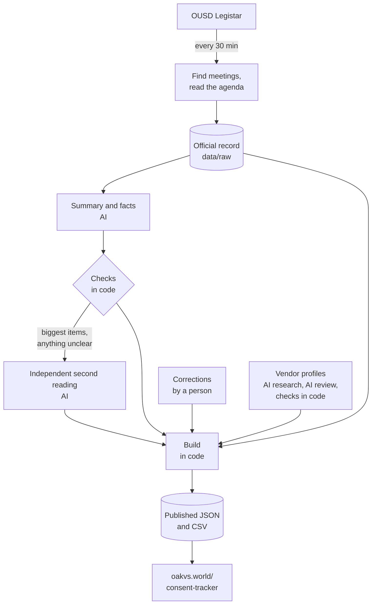

# OUSD Consent Tracker data

This repository holds data tracking every item the Oakland Unified School District (OUSD) Board of Education has voted on through its General Consent Report since <!-- generated:since -->August 2022<!-- /generated:since -->, and a pipeline to fetch, store and enrich that data via LLMs. Included in the dataset is the official text from Legistar, a short plain-language summary, dollar amounts, the outcome and votes, a vendor profile. 

The data backs the [Consent Report Tracker on the Oakland vs. the World blog](https://oakvs.world/consent-tracker), and this repo is made public for anyone who wants the data itself, or wants to see exactly how it's made.

The blog and this tracker are independent projects. It isn't an official OUSD platform and isn't affiliated with the district. All engineering, compute and hosting costs are donated by [Aleph](https://aleph.dev).

<!-- generated:stats -->As of October 2, 2026, it covers 92 Board meetings, from August 10, 2022 to September 23, 2026. That's 7,600 consent items authorizing $3866.8 million in spending, plus $467.5 million in grants and other money coming in, across 1,548 vendors and partners.<!-- /generated:stats -->

## Why this exists

At most of its meetings, the OUSD Board approves tens of millions of dollars in one vote. The General Consent Report bundles anywhere from a handful to a few hundred contracts, grants and amendments, and Board members and the public usually get only a few days to read it, either as a long PDF or through Legistar, the district's agenda system. While the data is public it isn't easy to read, search, or follow from one meeting to the next.

I'm the parent of two OUSD students and have been building websites for over twenty years, and I've struggled to understand pretty much every consent report I've read. This project uses AI to work through each report as soon as it's posted. Every item gets a short summary, the money is added up the same way every time, and there's a running record of what was approved and what changed along the way. I don't think the district makes this hard on purpose; it doesn't have the time or staff to present it any other way. The hope is that the Board, district staff, reporters and families can work from the same set of facts about how money gets spent.

Everything here is built from OUSD's own public records, and the official text is always included. The summaries are there to help you read and understand it, but are AI-generated, so keep that in mind.

## What you'll find in each item

Some of what's attached to each item comes straight from Legistar: the title, the official action text, the file and agenda numbers, the presenting office, the vendor number, the funding source, attachments, and the history of actions and votes. 

Much of the data is computed by ordinary code with no AI involved, like the meeting totals, most of the flags, which items belong to the same vendor, and which amendments go with which contract.

Then, some of it is written by AI and then checked. That covers the headline and summary, the category and action type, the vendor name, any schools mentioned, the contract dates, the dollar amounts, and four of the flags. The model is (currently) Claude, made by Anthropic, but this may change as open-weight models improve and become less expensive and resource-intensive. Each AI-written record says which model and which version of the instructions produced it.

## How the data gets made



### 1. Finding meetings

Legistar's meeting listings are broken for OUSD for whatever reason, so this pipeline works out the schedule another way. District staff tend to file agenda items with a target date long before the agenda is published, and once five or more items are filed for a date's consent report, that date counts as an upcoming meeting. When the agenda goes up, the meeting is matched to its Legistar record by the file numbers on it.

### 2. Reading the agenda

Once an agenda is official, the pipeline in this repo pulls the consent section of the agenda (via the Legistar public API) and each item's full record. The section is found by its heading and agenda letter, because Legistar's own "consent" marker isn't reliable. What comes back is saved as a snapshot in `data/raw/`, and that snapshot is the official record the rest of the process works from. Open meetings are re-checked every 30 minutes, so agenda changes show up within the hour, and outcomes are refreshed daily until every item has been acted on.

### 3. Summarizing each item

For each item, the AI reads only the official text. It writes a headline (110 characters at most) and a two- or three-sentence summary aimed at about an 8th-grade reading level, and it pulls out the facts: who the vendor is, which schools are named, the contract dates, the category, and the dollar amounts, including any prior and new totals and whether the amount is a yearly limit. Its instructions are in [`pipeline/prompts/`](pipeline/prompts/). They ask for neutral wording and spelled-out acronyms, and tell it not to guess at anything the text doesn't say. Individuals who contract in their own name are described by their role rather than named in headlines, as a courtesy.

### 4. Checking the numbers

Before a summary is published, code checks that every dollar amount appears word for word in the official text, and that the passage quoted as evidence is copied exactly. Nothing gets calculated, rounded or estimated. If a check fails, the errors go back to the AI and it gets up to three tries. An item that still doesn't pass shows only its official text, marked "Summary pending," until it's sorted out.

### 5. A second reading

The 20 largest items in each meeting get a second, independent reading of the money, as do items that failed a money check, items where the first reading thought the official text itself had a mistake, and headlines that might name a person. The second reader never sees the first reader's answer. If the two disagree in a way that would change the totals, a third reading settles it by majority, and the comparison is done in code. A disagreement that's still significant (more than $10,000 and more than 1% of the item) gets flagged for a human to look at.

### 6. Corrections

Corrections live in [`data/overrides/`](data/overrides/) and always win over what the AI wrote. A reviewed correction marks its item `human_reviewed`, and if it changes something that was already published, the item gets a dated note. A correction also carries over to the same file number at other meetings, as long as the official text is identical.

### 7. Building the published files

A build step puts it all together: the official record first, then the AI readings, then any corrections. It works out totals, flags and each item's review status, and writes `data/published/` and `data/exports/`. Run it twice on the same inputs and you get identical files, down to the byte, and the tests check for that.

### 8. Vendor profiles

Organizations (never individuals) can get a short profile with a description and public contact details. An AI researcher looks the vendor up in public sources like its own website and state, IRS and federal registries. Before a profile is published, the researcher has to be confident it found the right organization, with at least two separate pieces of evidence. Then a second AI reviewer has to agree it's the same organization and that the sources back up the description. Finally, code fetches every page cited and confirms each phone number, email, address, registry ID and legal name appears there exactly as written. Anything that doesn't check out is left off. These profiles don't come from OUSD and can go out of date.

### 9. Publishing

Every change becomes a commit in this repository with a readable message, like `2026-10-14: agenda posted — 87 items`, and the website rebuilds afterward. The official text goes up first, usually within half an hour of an agenda appearing in Legistar, and the summaries follow once they pass their checks. Between the two, the git history is a complete record of every agenda revision, outcome and correction.

### Which models wrote what

<!-- generated:models -->
| Records | Model |
|---|---|
| Summaries, August 2022 – June 2025 (5,451 items) | Claude Sonnet, run as Claude Code agents (`sonnet-agent`, prompt `enrich.v3`) |
| Summaries, August 2025 – September 2026 (1,886 items) | Claude Sonnet, run as Claude Code agents (`sonnet-agent`, prompt `enrich.v2`) |
| Summaries, June 2026 (263 items) | An earlier prototype (`prototype-v1`, prompt `enrich.v1`) |
| Second readings, August 2022 – September 2026 (2,271 items) | Claude Sonnet, run as Claude Code agents (`sonnet-agent`, prompt `verify.v1`) |
| Vendor research (740 vendors, 512 published) | Claude Sonnet, run as Claude Code agents (`sonnet-agent`) |
<!-- /generated:models -->

New items from October 2026 on are summarized by Claude Opus 5.5 through the Claude API (prompt `enrich.v4`), which also does the tie-breaking third readings. Their second readings come from Claude Sonnet 5.5 (prompt `verify.v2`). They'll show up in the table above as they're written.

Switching models or instructions doesn't quietly rewrite older records. New instructions get a new version number and are compared against the existing summaries before they're used.

## How the money is counted

Each item with money shows one main number, which is what that vote approves.

For a new contract, that's the most the district has agreed to pay. Most contracts set a "not to exceed" ceiling, so the district may end up paying less, but it can't pay more without another vote.

For a change to an existing contract, it's only the new money. If a $100,000 contract goes up to $150,000, the vote counts as $50,000, since the original $100,000 was approved at an earlier meeting.

Grants and other money coming in are counted separately from spending. Cuts to existing contracts are noted on the item but aren't subtracted. Yearly limits ("up to $X per year") are totaled on their own, so they don't get mixed in with one-time amounts. Caps on what the district can earn by auctioning surplus property aren't spending, so they're left out.

Every number comes from the official text. If the text doesn't state an amount, the data doesn't either, and nothing is rounded in the data.

## Flags

Flags point out how something was done. They don't say anything about anyone's motives, and most flagged items are routine and perfectly legal.

| Flag | What it means | Set by |
|---|---|---|
| Voted on separately | Taken out of the single consent vote: voted on separately, withdrawn, referred, postponed or decided at a later meeting | Legistar's record |
| After work began | The agreement started before this meeting, or it's a ratification with no start date | Code |
| No bid | Bought through another agency's contract, a state schedule, or a legal exception to bidding | AI, from the text |
| Raises existing contract | An expense where the text gives a previous total and a higher new one | Code |
| Large increase | Raises an existing contract by half or more | Code |
| Text discrepancy | A confirmed error in the official text, like numbers that don't add up or a title that doesn't match | Confirmed by code, a second AI reading, or a person |
| Delayed at earlier meeting | Postponed, continued or failed at an earlier meeting | Code, from Legistar's history |
| Yearly cap | Sets a limit per year instead of a total | Code |
| No total stated | A yearly cap over several years with no overall total in the text | Code |
| Multi-year | The term runs longer than one school year | AI, from the text |
| Time extension only | Moves the end date without adding money | AI, from the text |
| Emergency | The text describes emergency work or contracting | AI, from the text |

Every item also has a review status. `auto_ok` means it passed every check. `needs_review` means something is waiting on a person, and `review.alerts` says what. `blocked` means it failed a hard check, so only the official text is shown. `human_reviewed` means a person signed off, and `pending` means there's no summary yet. <!-- generated:review -->Right now 7,556 items are `auto_ok`, 25 are `human_reviewed` and 26 are `needs_review`.<!-- /generated:review -->

## Known limitations

The checks make the worst kind of mistake, a wrong or made-up dollar amount, very unlikely. A summary can still get the gist of an item wrong, though, and categories are sometimes a judgment call. When in doubt, go by the official text, which is always right next to the summary.

Coverage starts in <!-- generated:since -->August 2022<!-- /generated:since --> and only includes consent items. Items on the regular agenda aren't here, and neither are meetings without a consent report.

Legistar has some quirks the pipeline works around. Its "Pass" flag sometimes disagrees with the recorded motion, for instance, and items pulled from a consent report are sometimes decided at a later meeting. The known ones are listed in [`pipeline/README.md`](pipeline/README.md).

Vendors are grouped by their OUSD vendor number and name. A typo in a vendor number only gets reconciled when the names match too, so the same organization occasionally shows up twice.

Vendor profiles can be missing or stale. Some vendors have very little public presence, some share a name with other organizations, and some just couldn't be verified.

## Getting the data

| If you want | Look at |
|---|---|
| A spreadsheet | [`data/exports/items.csv`](data/exports/items.csv), with one row per item (including the official text). There's also [`meetings.csv`](data/exports/meetings.csv), [`vendors.csv`](data/exports/vendors.csv), and a CSV for each meeting in [`data/exports/meetings/`](data/exports/meetings/). |
| What each column means | [`data/exports/datapackage.json`](data/exports/datapackage.json), a [Frictionless Data Package](https://datapackage.org/) describing every column and its type |
| Everything, as JSON | [`data/published/`](data/published/), starting with `index.json`. Each meeting file has its items with history, votes, checks and attachments, and there are vendor files and `upcoming.json` for the next meeting. |
| Schemas | [`schema/`](schema/), with a JSON Schema (draft 2020-12) for every file |
| A fixed version to cite | Tagged releases, archived on Zenodo with a DOI (see [`CITATION.cff`](CITATION.cff)) |

The files sit at stable paths, so you can read them straight from GitHub:

```bash
curl -s https://raw.githubusercontent.com/oakvs/ousd-consent-data/main/data/published/index.json | jq '.meetings[0]'
```

```python
import pandas as pd
items = pd.read_csv("https://raw.githubusercontent.com/oakvs/ousd-consent-data/main/data/exports/items.csv")
```

There's a mirror on [Codeberg](https://codeberg.org/oakvs/ousd-consent-data) too. The CSVs are UTF-8 with a header row. Google Sheets opens them as is; in Excel, use **Data → From Text/CSV** so accented letters and dashes come through properly.

## Found a mistake?

Thank you for looking closely. A quick heads-up first: this project is maintained by one busy dad in his spare time. I read every report and I'll get to yours, but it may take a while, so please be patient.

The first thing to figure out is where the mistake lives. Every item on the tracker links to its official page on Legistar (the `legistar_url` column in the CSV). Open it and compare.

**If the official record on Legistar has the same problem**, it's an error in OUSD's own records, and the district is the only one who can fix it. This project copies those records as published. Contact the [Office of the Board of Education](https://www.ousd.org/board-of-ed), which manages Board agendas and Legistar, at boe@ousd.org or (510) 879-1940 (weekdays, 8:30 to 4:30). If you're looking for documents that aren't on Legistar, OUSD takes [Public Records Act requests](https://www.ousd.org/communications-public-affairs/public-records-act-requests) at publicrecords@ousd.org.

**If Legistar is right and the tracker is wrong**, that one's on me (and robots 🤖). That covers a summary, headline, dollar amount, category, flag or vendor profile that doesn't match the official record, or an item that's missing or out of place. Please [open an issue](https://github.com/oakvs/ousd-consent-data/issues/new/choose) using the "Something's wrong with an item" form. It asks for the meeting date, the item's file number, what's wrong and what the official text actually says, which is everything needed to check and fix it quickly. Confirmed fixes go into `data/overrides/`, and the item gets a dated correction note.

If you'd like to make the fix yourself, that's even better and greatly appreciated. [CONTRIBUTING.md](CONTRIBUTING.md) explains how.

## Privacy

This data is about public business: contracts, and the organizations that hold them. District staff email addresses that turn up in Legistar records are removed before anything is saved. People who contract in their own name aren't named in headlines and are never researched. Vendor profiles only include an organization's public business contact information.

## What's in this repository

```
data/
  raw/              the official record: one Legistar snapshot per meeting
  enrichments/      AI summaries and facts, with the model and prompt version for each
  verifications/    second readings
  overrides/        corrections, which always win over AI output
  legistar/vendors/ every Legistar record for each vendor
  vendor-research/  vendor profiles, with their checks and review
  published/        what the website reads, rebuilt by the build
  exports/          CSVs and datapackage.json, also rebuilt by the build
  meetings.json     the list of meetings
  llm-state.json    AI bookkeeping: monthly spending, and items that keep failing their checks
packages/consent-schema/   data schemas and helpers, shared with the website
pipeline/                  the code: Legistar client, checks, build, AI steps, prompts, tests
schema/                    JSON Schema generated from packages/consent-schema
```

## Running it yourself

You'll need Node 22 or newer.

```bash
npm ci
npm test                             # includes checking that the build reproduces the published data exactly
npm run consent:build                # rebuild data/published and data/exports
npm run consent:run -- --dry-run     # run one live update on a scratch copy without changing anything
```

The AI steps need an `ANTHROPIC_API_KEY`. Without one, `consent run` still publishes the official text. [`pipeline/README.md`](pipeline/README.md) covers how the pipeline works, and [`RUNBOOK.md`](RUNBOOK.md) covers running it day to day.

## License and citation

The code is under the [MIT license](LICENSE). This project's own work, meaning the headlines, summaries, classifications, flags, second readings and vendor profiles, is under [CC BY 4.0](LICENSE-DATA). If you use it, please credit "OUSD Consent Tracker, Oakland vs. the World (oakvs.world)" and link back here. The official Legistar text and records are public records of the Oakland Unified School District.

To cite a specific version, use the DOI of a tagged release. [`CITATION.cff`](CITATION.cff) has the details, and GitHub's "Cite this repository" button uses it.
